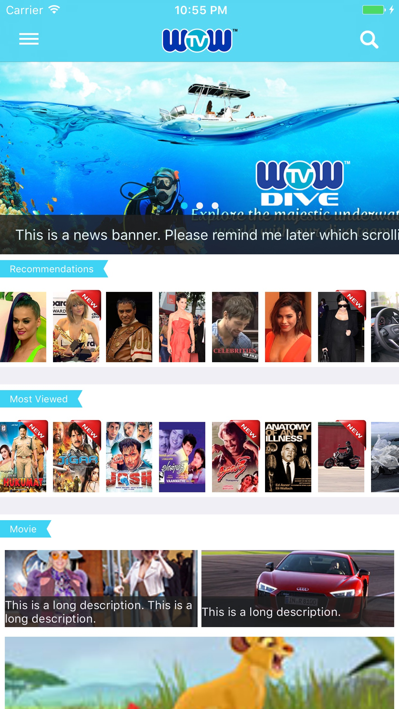
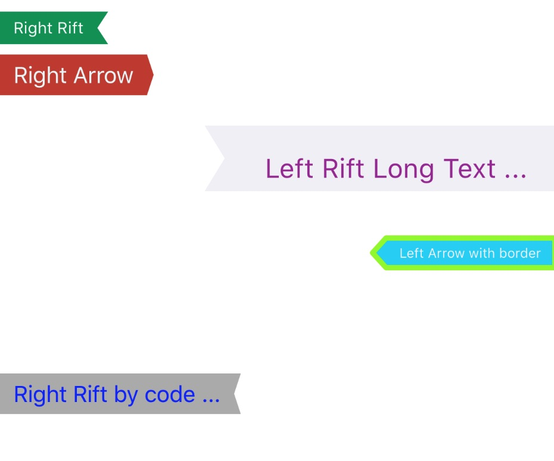

# WOWRibbonView

[](https://travis-ci.org/Zhou Hao/WOWRibbonView)
[](http://cocoapods.org/pods/WOWRibbonView)
[](http://cocoapods.org/pods/WOWRibbonView)
[](http://cocoapods.org/pods/WOWRibbonView)



- Showing Ribbon with both direction (left, right) and two different types (rift and arrow) 
- Auto resizable



## Example

To run the example project, clone the repo, and run `pod install` from the Example directory first.

## Requirements

## Installation

WOWRibbonView is available through [CocoaPods](http://cocoapods.org). To install
it, simply add the following line to your Podfile:

```ruby
pod "WOWRibbonView"
```

## Author

Zhou Hao, zhou.hao.27@gmail.com

## License

WOWRibbonView is available under the MIT license. See the LICENSE file for more info.

## Known Issues

- @IBInspectable not support font
- The position is not correct in Storyboard sometimes. I don't know the reason yet.

## References

[Autolayout tool](https://autolayoutconstraints.com/)

Help to write Autolayout code.
